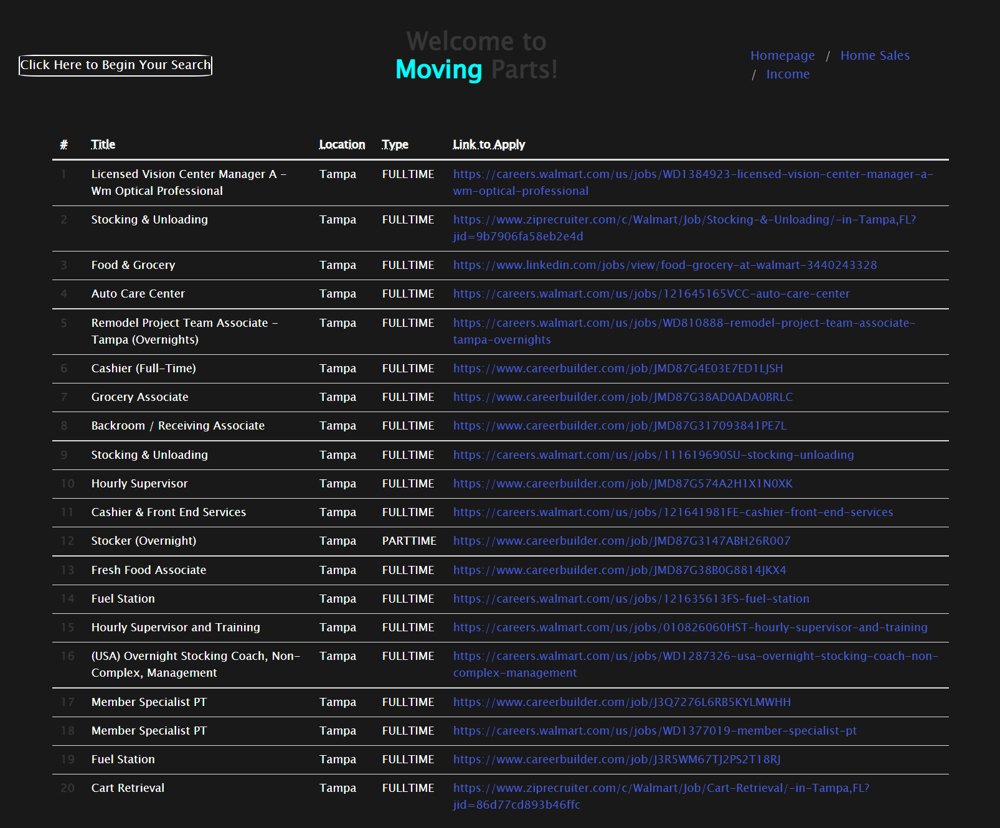

# Moving-Parts
Project #1 for On The Move

## Project Description
Moving Parts is a website designed to help people who are planning to move to another area to accrue helpful information about the location they're eyeing, being able to grab such info as the median income and rent, jobs in your field, and home sales for the area in question. The user can put all of these together and have a pretty good idea of if this area meets their needs.

## Project Components
This website was built using HTML, CSS, Bulma, Jquery, Javascript, and FontAwesome. The API's used to add user-requested data to our pages are: Zillow, Household Income by Zip Code, Jsearch, and the Realty Mole API. These should be self-explanatory, Zillow was used for our home sale page, and the Realty Mole API was used for the rent estimator.

## Project Challenges
The biggest challenge for this project was implementing the API's and having them output to our page correctly, as well as fine-tuning our CSS to ensure that everything is formatted correctly on the page. We had trouble specifically with the job search and income/rent estimator api's but managed to fix them with a for loop and an event.preventDefault() respectively.

## Project Screenshots
### Home Page

### Income/Rent Estimator

### Job Search

### Home Sales

## Deployed Application

 https://boy-son.github.io/Moving-Parts/

## Credits
This project was created by Quentin Jones, Tommy Santos, Seth Swindell and Branden Wheat
